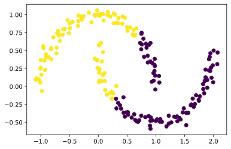

In this blog post, we will be exploring *clustering*. Clustering objects might seem intuitively easy to the human mind, but computers must have some mathmatical process to replace our intution.

```python
import numpy as np
from sklearn import datasets
from matplotlib import pyplot as plt
```


```python
n = 200
np.random.seed(1111)
X, y = datasets.make_blobs(n_samples=n, shuffle=True, random_state=None, centers = 2, cluster_std = 2.0)
plt.scatter(X[:,0], X[:,1])
```


    <matplotlib.collections.PathCollection at 0x2218cea3b20>


    

    


If we take a look at these blobs, we can imagine how we might cluster them. But let's take a look at how a computer might cluster them using `kmeans`.


```python
from sklearn.cluster import KMeans
km = KMeans(n_clusters = 2)
km.fit(X)

plt.scatter(X[:,0], X[:,1], c = km.predict(X))
```


    <matplotlib.collections.PathCollection at 0x2218e6f9af0>


    

    

Looks pretty good! But what if we have some more complicated blobs.


```python
np.random.seed(1234)
n = 200
X, y = datasets.make_moons(n_samples=n, shuffle=True, noise=0.05, random_state=None)
plt.scatter(X[:,0], X[:,1])
```


    <matplotlib.collections.PathCollection at 0x21136364310>


    

    


```python
km = KMeans(n_clusters = 2)
km.fit(X)
plt.scatter(X[:,0], X[:,1], c = km.predict(X))
```


    <matplotlib.collections.PathCollection at 0x2219003a550>


    

    


`kmeans` does not perform as well as we thought. Is there any other method we can use to cluster these blobs? Enter: **Spectral Clustering**

## Constructing a similarity matrix

Instead of looking for circles as in `kmeans` as a method to get clusters, we can use the distance between points to generate our clusters. To do this, we will generate an $$ n \times n$$ matrix where each row and column corresponds to a point in our matrix $$\mathbf{X}$$. Each entry $$ij$$ will correspond to the distance between points $$\mathbf{X}_i$$ and $$\mathbf{X}_j$$. 

Once we have a matrix of the pairwise distances, we will see if they lie within a specified distance, called epsilon. If the distance between two points is less than epsilon, we will replace that value with a 1 in a new similarity matrix $$\mathbf{A}$$, indicating these points have a potential connection. Otherwise, a pair of points that lies outside the distance epsilon will have a value 0. Beacause we do not want to compare the same points to each other, we will place 0's along the digagonal of the matrix. 


```python
from sklearn.metrics import pairwise_distances
def make_simMatrix(X, e):
    # create matrix that includes distances between each pair of points
    r = pairwise_distances(X)
    # square matrix of shape n x n
    new = np.ones((n,n)) 
    # replace entries less greater than epsilon with 0
    new[r > e] = 0 
    # fill the diagonal with 0s
    np.fill_diagonal(new, 0)
    return new
A = make_simMatrix(X, 0.4)
A
```


    array([[0., 0., 0., ..., 0., 0., 0.],
           [0., 0., 0., ..., 0., 0., 0.],
           [0., 0., 0., ..., 0., 1., 0.],
           ...,
           [0., 0., 0., ..., 0., 1., 1.],
           [0., 0., 1., ..., 1., 0., 1.],
           [0., 0., 0., ..., 1., 1., 0.]])


We can see here we have a $$ n \times n$$ matrix, with each entry corresponding to whether or not there is a connection between two points, signified by the number 1. 

## Cut and Volume

Now that we have the distances between two given points stored in the matrix $$\mathbf{A}$$, we can begin to compute functions that will allow us to characterize the clusters.  
One of which is the *binary norm cut objective*, which can be described as

$$N_{\mathbf{A}}(C_0, C_1)\equiv \mathbf{cut}(C_0, C_1)\left(\frac{1}{\mathbf{vol}(C_0)} + \frac{1}{\mathbf{vol}(C_1)}\right)\;.$$

In this expression, 
- $$\mathbf{cut}(C_0, C_1) \equiv \sum_{i \in C_0, j \in C_1} a_{ij}$$ is the *cut* of the clusters $$C_0$$ and $$C_1$$. 
- $$\mathbf{vol}(C_0) \equiv \sum_{i \in C_0}d_i$$, where $$d_i = \sum_{j = 1}^n a_{ij}$$ is the *degree* of row $$i$$ (the total number of all other rows related to row $$i$$ through $$A$$). 

Let's break this down piece by piece

### Cut

We will first look at the *cut* portion. It's kind of what the name says: we are trying to determine how many "connections" must be cut to fit a certain set of labels `y`. We look at the cluster labels generated by `kmeans`, which is stored in `y`, and whether or not a pair of points have a "connection" (denoted by the presence of a 1 in $$\mathbf{A}$$). If the points have a connection and are in different clusters, we must *cut* that connection. Thus, a low cut value means good clustering corresponding to the values of the matrix $$\mathbf{A}$$. 
{::options parse_block_html="true" /}
<div class="gave-help">
I suggested to some of my peers to take this kind of graph and network approach to explaining what cut actually is. It helped me fully visualize what cut actually was in term of severing "connections" between each point.
</div>
{::options parse_block_html="false" /}
```python
def cut(A,y):
    c = 0 # intialize cut
    # iterate through each entry of A
    for row in range(A.shape[0]):
        for col in range(A.shape[1]):
            # each row and column each represent one point
            # check see if points are in same column
            if y[row] != y[col]:
                # check to see if there is a connection that needs to be cut
                if A[row][col] == 1:
                    c +=1
    return c
cut(A,y)
```


    26


26 is not terrible. But let's see what the cut value would be if the given labels `y` were not generated by a different clustering algorithm but instead were totally arbitrary.

```python
newLabs = np.random.randint(2, size = n)
cut(A, newLabs)
```


    2184

Yes, that is a lot higher.

### Volume 

Now, we need a way to characterize the sizes of each cluster, as to normalize the cut value. We can do this by first computing the *degree* of each row. The degree of each row represents the number of connections one given point has (as each row represents one point in the matrix $$\mathbf{X}$$). We then take the labels given in `y` for each cluster and compute the sum of the degrees for the points corresponding to that cluster.

After we calculate this, we will have all components to calculate the binary normcut objective.

```python
def vols(A,y):
    d = A.sum(axis = 0) # sum of each row
    c0 = d[y == 0].sum() # get sum of rows in cluster 0
    c1 = d[y == 1].sum() # get sum of rows in cluster 1
    return(c0, c1)
def normcut(A,y):
    volume = vols(A,y)
    # compute normcut according to formula
    return cut(A,y) * ((1/volume[0]) + (1/volume[1]))
```

Again, if we look at the normcut of the arbitrar labels, we see the values are much less desireable.


```python
normcut(A,y), normcut(A, newLabs)
```


    (0.02303682466323045, 2.0480047195518316)


## Preperation for Optimization

Now, in preperation for creating a function to minimize, we will transform our vector $$\mathbf{y}$$ so that it contains a 0 for a given point's cluster is negative and a 1 if it is positive. 

```python
def transform(A,y):
     new = y.copy()
     # assign positive or neg vol according to label
     new[new == 0] = vols(A,y)[0]
     new[new == 1] = -vols(A,y)[1]
     new = 1/new
     return new

```


```python
z = transform(A,y)
z
```


    array([-0.00045106, -0.00045106,  0.00043497,  0.00043497,  0.00043497,
            0.00043497,  0.00043497,  0.00043497, -0.00045106, -0.00045106,
           -0.00045106,  0.00043497, -0.00045106, -0.00045106, -0.00045106,
           -0.00045106, -0.00045106,  0.00043497,  0.00043497,  0.00043497,
           -0.00045106, -0.00045106, -0.00045106,  0.00043497,  0.00043497,
           -0.00045106,  0.00043497, -0.00045106, -0.00045106,  0.00043497,
            0.00043497, -0.00045106, -0.00045106, -0.00045106, -0.00045106,
           -0.00045106,  0.00043497, -0.00045106, -0.00045106,  0.00043497,
           -0.00045106,  0.00043497,  0.00043497,  0.00043497,  0.00043497,
            0.00043497,  0.00043497, -0.00045106, -0.00045106, -0.00045106,
            0.00043497,  0.00043497, -0.00045106, -0.00045106,  0.00043497,
            0.00043497, -0.00045106, -0.00045106, -0.00045106,  0.00043497,
            0.00043497,  0.00043497, -0.00045106,  0.00043497, -0.00045106,
            0.00043497,  0.00043497,  0.00043497,  0.00043497, -0.00045106,
           -0.00045106, -0.00045106, -0.00045106,  0.00043497,  0.00043497,
            0.00043497, -0.00045106,  0.00043497, -0.00045106,  0.00043497,
            0.00043497,  0.00043497,  0.00043497, -0.00045106, -0.00045106,
           -0.00045106, -0.00045106,  0.00043497,  0.00043497,  0.00043497,
            0.00043497, -0.00045106,  0.00043497,  0.00043497, -0.00045106,
           -0.00045106, -0.00045106, -0.00045106,  0.00043497,  0.00043497,
           -0.00045106, -0.00045106, -0.00045106,  0.00043497, -0.00045106,
           -0.00045106,  0.00043497,  0.00043497, -0.00045106, -0.00045106,
            0.00043497,  0.00043497,  0.00043497, -0.00045106,  0.00043497,
            0.00043497,  0.00043497,  0.00043497, -0.00045106, -0.00045106,
           -0.00045106,  0.00043497, -0.00045106, -0.00045106, -0.00045106,
            0.00043497, -0.00045106,  0.00043497, -0.00045106, -0.00045106,
            0.00043497,  0.00043497,  0.00043497,  0.00043497, -0.00045106,
           -0.00045106, -0.00045106, -0.00045106, -0.00045106, -0.00045106,
           -0.00045106, -0.00045106,  0.00043497,  0.00043497, -0.00045106,
            0.00043497,  0.00043497,  0.00043497,  0.00043497,  0.00043497,
            0.00043497,  0.00043497,  0.00043497, -0.00045106, -0.00045106,
            0.00043497, -0.00045106,  0.00043497,  0.00043497,  0.00043497,
           -0.00045106, -0.00045106,  0.00043497,  0.00043497, -0.00045106,
           -0.00045106, -0.00045106,  0.00043497,  0.00043497,  0.00043497,
           -0.00045106,  0.00043497, -0.00045106, -0.00045106, -0.00045106,
            0.00043497,  0.00043497,  0.00043497,  0.00043497, -0.00045106,
           -0.00045106,  0.00043497,  0.00043497, -0.00045106, -0.00045106,
           -0.00045106,  0.00043497, -0.00045106, -0.00045106, -0.00045106,
            0.00043497, -0.00045106,  0.00043497, -0.00045106, -0.00045106,
           -0.00045106, -0.00045106,  0.00043497,  0.00043497,  0.00043497])


We can verify this vector is correct by checking to see if this equation is true

$$\mathbf{N}_{\mathbf{A}}(C_0, C_1) = 2\frac{\mathbf{z}^T (\mathbf{D} - \mathbf{A})\mathbf{z}}{\mathbf{z}^T\mathbf{D}\mathbf{z}}\;,$$

```python
D = np.diag(sum(A))
# calculate using formula
rhs = 2*((z.T@(D-A)@z))/(z@D@z)
# check to see if equal using computer precision
np.isclose(normcut(A,y), rhs)
```


    True

{::options parse_block_html="true" /}
<div class="got-help">
In this section, I got some advice to use `D = np.diag(sum(A))` rather than initalizing an array of zeros and filling in the digaonals using the `fill_diagonal()` function! Great method to shorten my code and all it took was perhaps a little googling. 
</div>
{::options parse_block_html="false" /}

## Minimizing normcut objective

Now we can try to minimize our function, as to find the lowest value of the normcut objective to theoretically produce the best clusters. We can do this by by substituting for 
by substituting for $$\mathbf{z}$$ the orthogonal complement of $$\mathbf{z}$$ relative to $$\mathbf{D}\mathbf{1}$$. This is done in the `orth_obj()` function.

```python
def orth(u, v):
    return (u @ v) / (v @ v) * v

e = np.ones(n) 

d = D @ e

def orth_obj(z):
    z_o = z - orth(z, d)
    return (z_o @ (D - A) @ z_o)/(z_o @ D @ z_o)
```
We will use the `minmize()` function from `scipy.optimize` library to minmize `orth_obj` with respect to $$\mathbf{z}$$

```python
from scipy.optimize import minimize

z_ = minimize(orth_obj, z).x
z_
```


    array([-1.83358192e-03, -2.41701407e-03, -1.20217848e-03, -1.41748055e-03,
           -9.85566538e-04, -1.23081951e-03, -5.85637745e-04, -8.67448765e-04,
           -2.13354581e-03, -1.82267270e-03, -2.18401808e-03, -1.18174147e-03,
           -1.12567412e-03, -2.27564662e-03, -2.49836000e-03, -2.32669078e-03,
           -2.03861438e-03, -1.27306582e-03, -1.24215828e-03, -1.14279389e-03,
           -2.24028198e-03, -1.12826575e-03, -2.25932974e-03, -1.41888901e-03,
           -8.52792711e-04, -1.94371416e-03, -1.07873687e-03, -2.00277669e-03,
           -2.16749789e-03, -1.20004626e-03, -1.00740381e-03, -2.04776516e-03,
           -2.38485923e-03, -2.15580280e-03, -2.15337541e-03, -2.30809736e-03,
           -8.52792709e-04, -2.46819872e-03, -2.33955477e-03, -1.16161974e-03,
           -2.22245287e-03, -1.27165024e-03, -1.12814187e-03, -3.46791450e-04,
           -9.25811423e-04, -1.41511352e-03, -1.27232761e-03, -2.31470109e-03,
           -2.35157140e-03, -1.11525028e-03, -1.13546644e-03, -1.14953692e-03,
           -2.25932974e-03, -2.21226758e-03, -7.09399119e-04, -1.15736913e-03,
           -2.38244765e-03, -1.43644797e-03, -2.25733591e-03, -1.34595432e-03,
           -4.20084181e-04, -1.11083763e-03, -2.05784603e-03, -1.25847371e-03,
           -2.04517353e-03, -1.08280321e-03, -4.20085215e-04, -8.54285131e-04,
           -1.42133407e-03, -2.33025254e-03, -2.03782912e-03, -2.38888501e-03,
           -2.18983062e-03, -1.34291608e-03, -1.14324611e-03, -1.65971009e-03,
           -1.93553493e-03, -1.27228978e-03, -2.39837146e-03, -1.09185745e-03,
           -1.44533289e-03, -1.05098371e-03, -1.22156255e-03, -2.26382833e-03,
           -2.25739439e-03, -2.33467196e-03, -2.15580280e-03, -1.35423075e-03,
           -1.13220494e-03, -1.27201952e-03, -7.25712474e-04, -2.05784603e-03,
           -1.17085020e-03, -1.13546644e-03, -1.43644756e-03, -1.82267270e-03,
           -2.46819872e-03, -2.40304151e-03, -9.53873197e-04, -1.14953692e-03,
           -2.47013673e-03, -2.35157140e-03, -2.31349781e-03, -6.55809136e-04,
           -2.22984646e-03, -2.33799496e-03, -9.04904381e-04, -1.34564810e-03,
           -2.35511032e-03, -2.26930963e-03, -9.81060423e-04, -1.23216622e-03,
           -1.20415245e-03, -2.33191750e-03, -1.12893706e-03, -7.78376693e-04,
            8.23734807e-05, -5.85638220e-04, -1.43644809e-03, -2.39001730e-03,
           -2.60596367e-03, -1.20834473e-03, -2.22118170e-03, -2.30538524e-03,
           -2.11880220e-03, -1.15342839e-03, -2.37693705e-03, -1.35917291e-03,
           -2.04776517e-03, -1.43644795e-03, -1.00395171e-03, -5.85639986e-04,
           -1.34595432e-03, -1.07238383e-03, -2.38598056e-03, -2.47173902e-03,
           -2.32133494e-03, -2.07601349e-03, -2.22248603e-03, -1.55192706e-03,
           -1.84556225e-03, -2.37802235e-03, -1.21757625e-03, -1.27588063e-03,
           -1.62197782e-03, -1.21523765e-03, -1.03793631e-03, -1.23437384e-03,
           -1.12840906e-03, -1.20795124e-03, -1.12814187e-03, -1.00395171e-03,
           -1.14324610e-03, -1.94371416e-03, -2.50540645e-03, -4.20085283e-04,
           -1.97564367e-03, -1.14953692e-03, -1.21523765e-03, -1.22156255e-03,
           -2.42200051e-03, -2.24456273e-03, -1.08612710e-03, -1.35423075e-03,
           -1.51454801e-03, -1.94371416e-03, -2.33799496e-03, -1.27588063e-03,
           -5.85635734e-04, -4.45230918e-04, -2.53373470e-03, -1.16183500e-03,
           -2.26930963e-03, -2.32100513e-03, -2.33467196e-03, -1.20096473e-03,
           -1.20024879e-03, -1.23437385e-03, -1.41541366e-03, -2.30538524e-03,
           -2.03861438e-03, -1.15075500e-03, -1.11083763e-03, -1.99740084e-03,
           -2.13354581e-03, -2.05040652e-03, -9.86822351e-04, -2.15337541e-03,
           -2.38244765e-03, -2.35157140e-03, -1.20096473e-03, -2.42200050e-03,
           -9.86822352e-04, -2.52226861e-03, -2.27495909e-03, -2.32669078e-03,
           -2.09431749e-03, -1.33500191e-03, -1.49819389e-03, -1.33636813e-03])


## Did it work?

If we were to replot our points and clusters so that  `z_[i] < 0` represents one cluster and `z_[i] >= 0` represents the other, does it give us our desired results? 


```python
colors = np.zeros(n)
colors[z_ < -0.0015] = 0
colors[z_ > -0.0015] = 1
colors
plt.scatter(X[:,0], X[:,1], c = colors)
```


    <matplotlib.collections.PathCollection at 0x221903ae070>


    

    
Kind of, but not really what we wanted.

## Eigenstuffs

I don't really understand this stuff so here is a good explaination of what happened: 

Explicitly optimizing the orthogonal objective is  *way* too slow to be practical. If spectral clustering required that we do this each time, no one would use it. 

The reason that spectral clustering actually matters, and indeed the reason that spectral clustering is called *spectral* clustering, is that we can actually solve the problem from Part E using eigenvalues and eigenvectors of matrices. 

Recall that what we would like to do is minimize the function 

$$ R_\mathbf{A}(\mathbf{z})\equiv \frac{\mathbf{z}^T (\mathbf{D} - \mathbf{A})\mathbf{z}}{\mathbf{z}^T\mathbf{D}\mathbf{z}} $$

with respect to $\mathbf{z}$, subject to the condition $\mathbf{z}^T\mathbf{D}\mathbb{1} = 0$. 

The Rayleigh-Ritz Theorem states that the minimizing $\mathbf{z}$ must be the solution with smallest eigenvalue of the generalized eigenvalue problem 

$$ (\mathbf{D} - \mathbf{A}) \mathbf{z} = \lambda \mathbf{D}\mathbf{z}\;, \quad \mathbf{z}^T\mathbf{D}\mathbb{1} = 0$$

which is equivalent to the standard eigenvalue problem 

$$ \mathbf{D}^{-1}(\mathbf{D} - \mathbf{A}) \mathbf{z} = \lambda \mathbf{z}\;, \quad \mathbf{z}^T\mathbb{1} = 0\;.$$

Why is this helpful? Well, $\mathbb{1}$ is actually the eigenvector with smallest eigenvalue of the matrix $\mathbf{D}^{-1}(\mathbf{D} - \mathbf{A})$. 

> So, the vector $\mathbf{z}$ that we want must be the eigenvector with  the *second*-smallest eigenvalue. 


So we can build a matrix $\mathbf{L} = \mathbf{D}^{-1}(\mathbf{D} - \mathbf{A})$ so that we can extract the eigenvector corresponding to the second smallest eigenvalue and use this to graph our points once more. 


```python
L = np.linalg.inv(D) @ (D - A)
Lam, U = np.linalg.eig(L)
ix = Lam.argsort()

Lam, U = Lam[ix], U[:,ix]

# 2nd smallest eigenvalue and corresponding eigenvector
z_eig = U[:,1]
colors = np.zeros(n)
colors[z_eig > 0] = 1
plt.scatter(X[:,0], X[:,1], c = colors)
```


    <matplotlib.collections.PathCollection at 0x22194cf1160>


    

    


Hey, that looks about right!  

## Synthesis

Let's put all of this together in one easy to use function:

```python
def spectral_clustering(X, epsilon): 
    """
    Computes clusters based for a given matrix of points using a 
    spectral clustering algorithm
    ==================================
    Parameters
    ----------------------------------
    X: an (n, 2) array of n points in 2d space

    epsilon: the distance between points to discrimnate different
    clusters
    =================================
    Returns
    labels: an array of the corresponding label of cluster for each
    given point
    """
    # generate similarity matrix
    A = make_simMatrix(X, epsilon)
    # generate matrix D with diagonal containing degree of row
    D = np.zeros((n,n))
    np.fill_diagonal(D, A.sum(axis= 0))
    # compute eigen value
    L = np.linalg.inv(D) @ (D - A)
    Lam, U = np.linalg.eig(L)
    ix = Lam.argsort()
    # get eigenvector corresponding to second lowest eigenvalue
    z_eig = U[:,ix][:,1]
    labels = np.zeros(n)
    labels[z_eig > 0] = 1
    return labels
```
{::options parse_block_html="true" /}
<div class="gave-help">
Since many of my peers had excellent code and explainations, I could primarily only find nitpicky errors. One of which was copying boiler plate code from lecture, which extracted both the second-to-last eigenvector and eigenvalue. In this problem, you will only need the eigenvector, so you can save a line of code by removing the extraction of the eigenvalue.
</div>
{::options parse_block_html="false" /}
```python
colors = spectral_clustering(X, 0.4)
plt.scatter(X[:,0], X[:,1], c = colors)
```


    <matplotlib.collections.PathCollection at 0x211364ba550>


    

    


## Testing our new function

Now that we have a fancy function to use, let's see if it works on other sets of data. We will first try it on the same set of moon data, except with a bit more samples and noise


```python
n = 1000
X, y = datasets.make_moons(n_samples=n, shuffle=True, noise=0.25, random_state=None)
colors = spectral_clustering(X, 0.4)
plt.scatter(X[:,0], X[:,1], c = colors)
```


    <matplotlib.collections.PathCollection at 0x21136190490>


    

    


```python
n = 1000
X, y = datasets.make_moons(n_samples=n, shuffle=True, noise=0.10, random_state=None)
colors = spectral_clustering(X, 0.4)
plt.scatter(X[:,0], X[:,1], c = colors)
```


    <matplotlib.collections.PathCollection at 0x211362685e0>


    

    

Looks like it still works!

Now we will try it on some bullseyes.


```python
n = 1000
X, y = datasets.make_circles(n_samples=n, shuffle=True, noise=0.05, random_state=None, factor = 0.4)
plt.scatter(X[:,0], X[:,1])
```


    <matplotlib.collections.PathCollection at 0x2113632b970>


    

    


There are two concentric circles. As before k-means will not do well here at all. 


```python
km = KMeans(n_clusters = 2)
km.fit(X)
plt.scatter(X[:,0], X[:,1], c = km.predict(X))
```


    <matplotlib.collections.PathCollection at 0x7f82dfb0bc18>


    

    

Now let's try our function

```python
colors = spectral_clustering(X, 0.4)
plt.scatter(X[:,0], X[:,1], c = colors)
```


    <matplotlib.collections.PathCollection at 0x21136389070>


    

    
Wow, works a lot better than kmeans!

We can experiment with different values of `epsilon` now. In the above example, we used `0.4`, but what happens if we try `1`?

```python
colors = spectral_clustering(X, 0.4)
plt.scatter(X[:,0], X[:,1], c = colors)
```


Not as well. How about `0.6`?
```python
colors = spectral_clustering(X, 0.4)
plt.scatter(X[:,0], X[:,1], c = colors)
```


Also not great. Let's go a little lower with `0.2`
```python
colors = spectral_clustering(X, 0.2)
plt.scatter(X[:,0], X[:,1], c = colors)
```


Looks similar to `0.4`. So our prime epsilon value is likely between `0.2` and `0.5`.

{::options parse_block_html="true" /}
<div class="got-help">
On the advice of my peers, I added some more experimentation of epsilon values to determine what the optimal distance to create connections might be.
</div>
{::options parse_block_html="false" /}